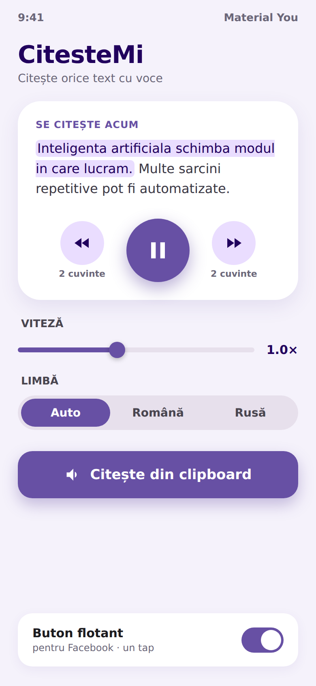
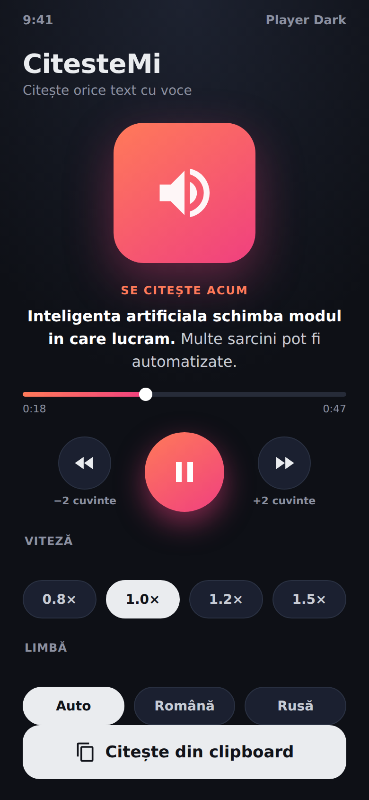
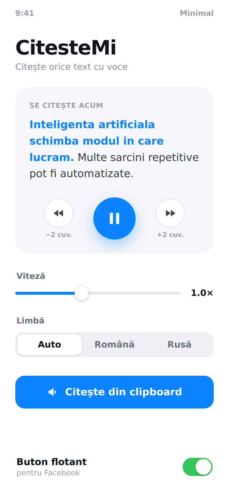
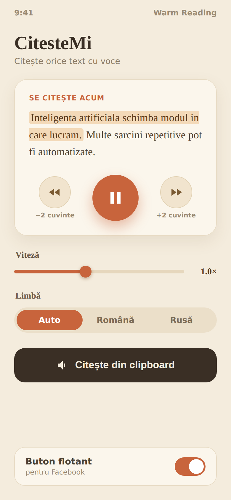

# Idei de design pentru ecranul principal

4 directii, fiecare inspirata dintr-o aplicatie simpla si populara. Toate arata
acelasi continut (ca sa compari STILUL), inclusiv controalele play/pauza si
inainte/inapoi cu cate 2 cuvinte. Spune-mi care iti place — sau o combinatie.

## 1. Material You (stil Google)
Luminos, prietenos, butoane rotunjite, accent mov.

## 2. Player intunecat (stil Spotify / Audible)
Fundal inchis, buton mare circular, bara de progres — senzatie de player audio.

## 3. Minimal alb (stil iOS)
Mult spatiu alb, elegant, accent albastru.

## 4. Lectura calda (stil Pocket / Kindle)
Tonuri de hartie calda, titlu cu serif — senzatie de citit confortabil.

